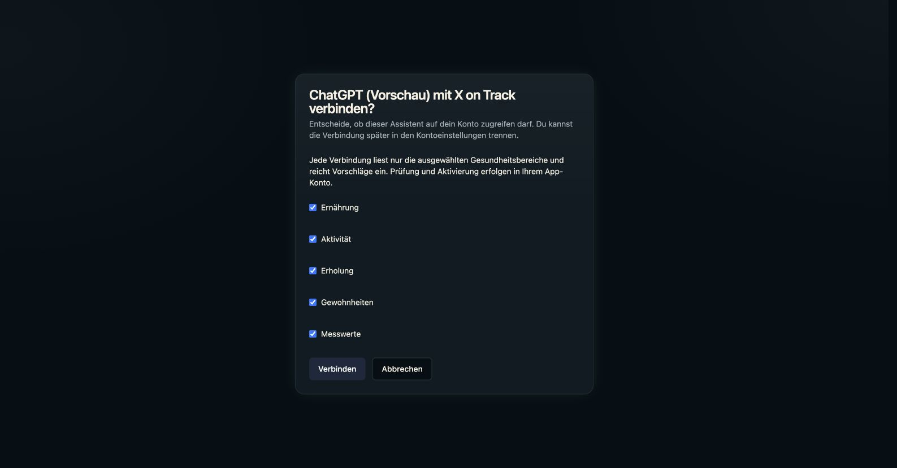
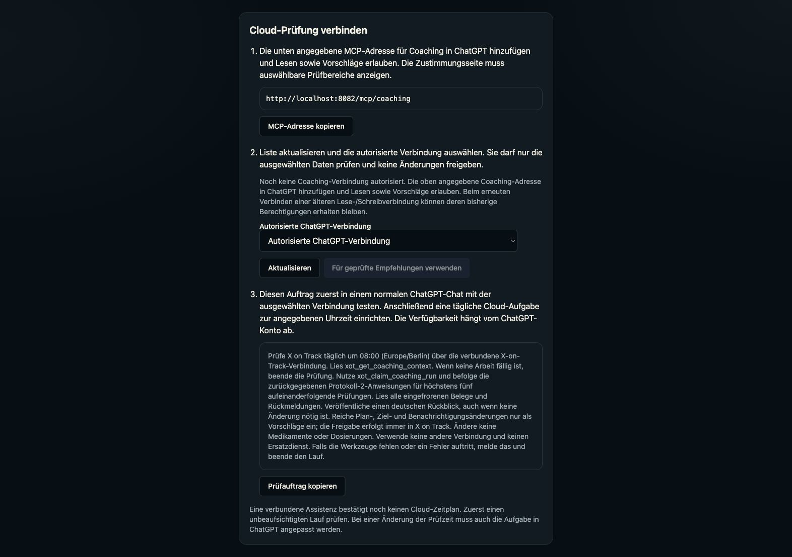

# Coaching OAuth bootstrap correction — 2026-10-06

## Verified cause

The existing `/mcp/chatgpt` address supports general read/write tools. It requires read access, while coaching requires both live proposal consent and an owner/client binding. A reconnect can preserve the client's earlier read/write scope request. The reported consent screen therefore correctly showed no proposal controls, and the Recommendations connection list correctly excluded that grant. Refreshing tools does not authorize another scope. The registered client's allowed scope list already included `mcp:propose`; manually editing that allowlist or owner consent is not a fix.

The consent client-name lookup also used `name`, whereas Better Auth's public OAuth client response uses `client_name`. That caused the generic assistant heading.

## Implementation

- Add `/mcp/coaching` as a distinct OAuth resource, registered by the existing Better Auth provider at normal startup. Discovery and authentication require `mcp:read mcp:propose`. Tokens addressed only to the old resource are rejected. There is no direct-write tool fallback.
- Reuse the existing transport, live revocation checks and coaching tool registration. Require an active protocol-2 binding and the existing feature flag. The owner approves selected areas through the existing consent flow; no account grants or bindings are created by deployment.
- Retain `/mcp/chatgpt` for existing general tools and previously bound coaching clients. No bundle IDs, credentials, health records, schemas, scheduler or model provider change.
- Phone/web setup copy the new shared path, explain empty authorized lists separately from failed loads, and explain why the old consent screen cannot enable coaching. New English copy has reviewed German overlays.
- Read the correct public client-name field and avoid describing broad legacy read access on a proposal-only consent screen.

## Validation

The frozen offline workspace install passed. `pnpm run validate` passed in Server, Frontend and Mobile, including German overlays, locale generation, TypeScript, lint, formatting and the existing mobile native asset checks. The web production bundle and VitePress documentation build passed.

54 focused tests passed (37 Server, 8 Frontend, 9 Mobile). They cover actual RSA-signed OAuth tokens, audience, expiration, required scopes, live consent revocation, missing/disabled/protocol-1 bindings, disabled coaching, exact six-tool exposure, POST-only transport, legacy tool compatibility, German consent/empty/error states, approved-area binding payloads and native address copying. Full backend/device suites are outside this targeted correction.

An isolated PostgreSQL-backed sample booted normally and registered a synthetic public OAuth client through the real registration endpoint. Both resource registrations were returned, and the new public discovery advertised only read/propose. The sample was stopped afterward. Browser component previews use isolated synthetic authentication fixtures, not a production fallback. They confirm German review-area checkboxes and the new setup guidance; they do not establish a completed OAuth round-trip.

## Owner verification remaining

Add the new coaching address as a new ChatGPT connection, approve read/proposal access and selected review areas, then refresh Recommendations and choose that connection. Older dynamically registered clients may need fresh registration for the additional resource; current metadata-based client registrations receive the resource through the provider's normal refresh/registration flow. Do not modify consent directly to simulate approval.

Verify that the selected connection lists the six protocol-2 tools, completes one manual review with a recap, and then completes an unattended run before treating a cloud schedule as operational. No owner production review, scheduled ChatGPT task, physical-device test or new TestFlight publication was performed for this correction.
